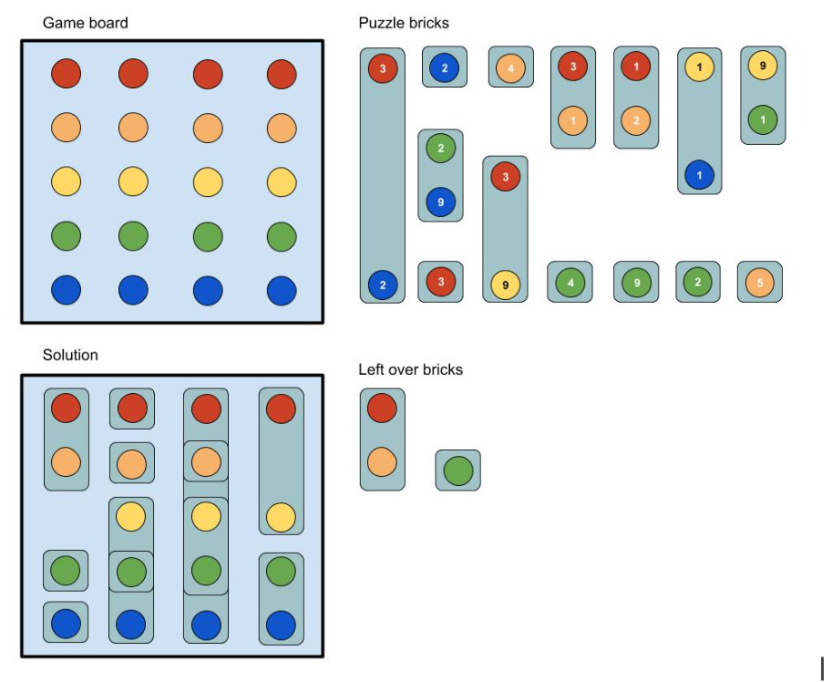

# Colourful Puzzle
This is a programming challenge. There is an example "placeholder solution" shown here in python and a version on javascript (simply converted from the python version), but you can use any language you want for your solution.

It should be possible to complete the challenge in **less than three hours**. The tests should execute in sub-second times for all of our test datasets. However, if you don't manage this, we prefer to see your partial solution than no solution.

We will also test your solution on other datasets which we do not provide here. 

## Introduction
In this problem we are going to solve a two-dimensional puzzle. 

The board is N units in height and M units in width. Each row of the board is assigned a unique colour. Puzzle bricks are pieces that contain at least one coloured token and a maximum of N coloured tokens. Each colour can occur at most once in every brick. Each brick also has a value associated with the coloured tokens, which adds to the score of the solution when placed on the puzzle board.

When placing bricks on the board, the following rules apply:
* Each brick can be used at most once. 
* A brick can only be placed in a column if it is compatible with all of the bricks that have already been placed in that column.

Two bricks are compatible if they do not have any colours in common so, for example, a brick with colours {0,2} is compatible with a brick that has colours {1, 3}. When placed in a column, these bricks would be compatible with any other brick that does not contain any of the colours {0, 1, 2, 3} and so forth.

**The goal is to find a valid placement of bricks on the board in a reasonable timeframe with their total score being as high as possible.**

## Illustration
The task is illustrated in the figure below:

## Task
Write a program in the language of your choice that reads the board dimensions and puzzle bricks from a standard input (stdin) and outputs a solution to the problem to standard output (stdout). 

We recommend using professional software design practices wherever possible.

The input is formatted as follows:
* The first line contains the board height N (i.e. the number of colours), board width M (number of columns) and the number of available bricks B separated by spaces.
* The following B lines contains series of integer pairs {C V} where C is the colour number and V is the associated score.

## Example input and output

Here is an example **input** (represented by the illustration, above):

    5 4 14
    0 3 4 2
    4 2
    3 2 4 9
    0 3
    1 4
    0 3 2 9
    0 3 1 1
    3 4
    0 1 1 2
    3 9
    2 1 4 1
    3 2
    2 9 3 1
    1 5

Your program should output at most M + 1 lines.
* The first line containing the overall score of your solution,
* each of the following lines containing the 0-based indexes of the bricks used in each column, where the 0th brick is the first brick specified in the input file. 

The **output** for the example would be:
    
    71
    6 7 1
    3 4 10 9
    0 13 12
    5 2

## Placeholder solution
The placeholder solution illustrates how to read the input and write the output in the appropriate format. Its "solution" is simply to place the first brick in the board and then finish. 

### Python placeholder
If you want to run the placeholder solution, you will need pipenv installed. Create the virtual environment:

    pipenv shell

Install dependencies:
    
    pipenv install

Run the code on the test dataset:
    
    python placeholder_solution.py < ./tests/eval-3-3-12.puzzle

You will see this answer:

    72
    0

### Javascript placeholder    
You will need node installed. Simply run:

    node placeholder_solution.js < ./tests/eval-3-3-12.puzzle

You will see this answer:

    72
    0    

## When you are done
Email your code back to us (zipped up if multiple files).
